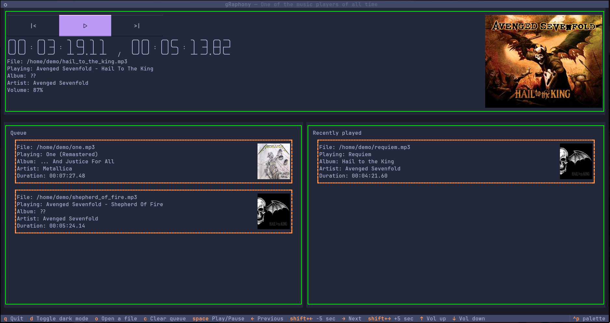
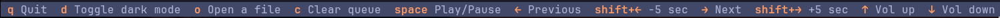
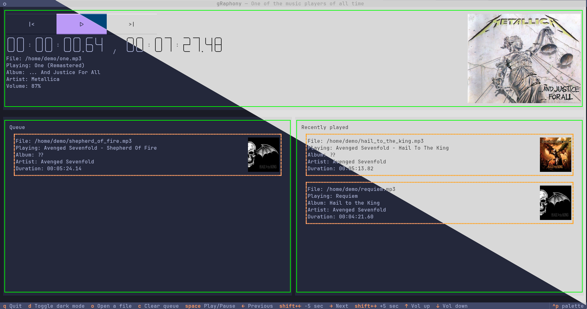
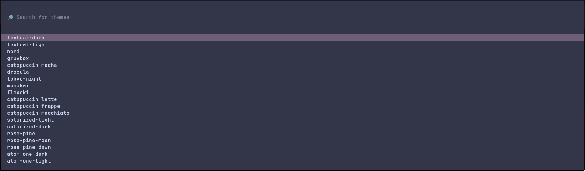
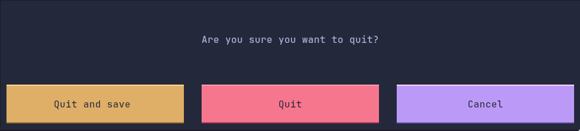
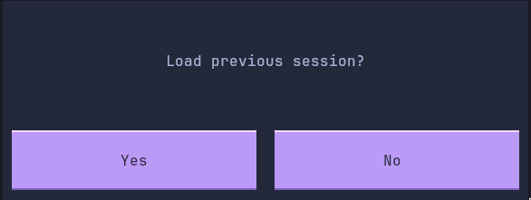

# gRaphony
One of the music players of all time. gRaphony lives ~~under your skin~~ in your terminal.

## Features
> It has them 

### It is in the terminal 
### Simple and keyboard focused navigation and control 
### Dynamic themes 
### Even more themes 
### And just like the internet, it never forgets  
 
## How to "install"
> Dont
Clone the repo, cd into it and:
```python
python -m venv venv
source ./venv/bin/activate # or activate.fish for fish
pip install -r requirements.txt
python main.py
```

## Supported platforms
- Linux
- macOS
- Android
- iOS
- Raspberry Pi
- Ikusi RPA-120 Satellite Dish 120cm
- Samsung RM90F67CECEO Smart Fridge 654l 9" Home Display

## TODO
- [x]    Plays music (if the planets align)
- [x]    Useless todo box to make the project look cooler 
- [x]    Usable interface
- [x]    Save / load current session
- [x]    Another point that it completely and utterly usesless
- [x]    Seeking
- [x]    "Are you sure" before exit.

